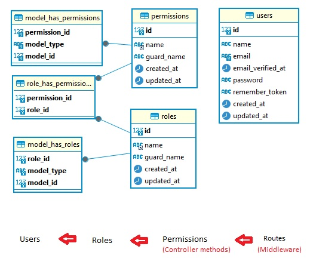

<p align="center"><a href="https://laravel.com" target="_blank"></a></p>
<hr/>



**Set up Laravel project**
```
$ composer create-project laravel/laravel roler

```

**Database setup**
```
DB_CONNECTION=mysql
DB_HOST=mysqlDB
DB_PORT=3306
DB_DATABASE=docker
DB_USERNAME=docker
DB_PASSWORD=docker
```

**Authentication package set up**
```
$ docker-compose exec -it app bash
$ composer require laravel/breeze --dev
$ php artisan breeze:install blade
```

**Database migration, node package install**
```
$ php artisan migrate
$ npm install
$ npm run dev
```

**Install Spatie Package**
```
$ composer require spatie/laravel-permission

In config/app.php, check addition of Permission provider 

'providers' => [
    // ...
    Spatie\Permission\PermissionServiceProvider::class,
];

$ php artisan vendor:publish --provider="Spatie\Permission\PermissionServiceProvider"

$ php artisan migrate

In app/Http/Kernel.php add RoleMiddleware, PermissionMiddleware and RoleOrPermissionMiddleware

```

**Setup middleware**
```
In app/Http/Kernel.php

protected $middlewareAliases = [
    // ...
    'role' => \Spatie\Permission\Middleware\RoleMiddleware::class,
    'permission' => \Spatie\Permission\Middleware\PermissionMiddleware::class,
    'role_or_permission' => \Spatie\Permission\Middleware\RoleOrPermissionMiddleware::class,
];
```

**Add trait to user mode**
```php

use Spatie\Permission\Traits\HasRoles;

class User extends Authenticatable
{
    use HasRoles;
    ...

``` 


**Create routes**
```php
Route::group(['middleware' => ['role:super-admin|admin']], function() {

    Route::resource('permissions', App\Http\Controllers\PermissionController::class);
    Route::get('permissions/{permissionId}/delete', [App\Http\Controllers\PermissionController::class, 'destroy']);

    Route::resource('roles', App\Http\Controllers\RoleController::class);
    Route::get('roles/{roleId}/delete', [App\Http\Controllers\RoleController::class, 'destroy']);
    Route::get('roles/{roleId}/give-permissions', [App\Http\Controllers\RoleController::class, 'addPermissionToRole']);
    Route::put('roles/{roleId}/give-permissions', [App\Http\Controllers\RoleController::class, 'givePermissionToRole']);

    Route::resource('users', App\Http\Controllers\UserController::class);
    Route::get('users/{userId}/delete', [App\Http\Controllers\UserController::class, 'destroy']);

});
```

**Seed database**
```php

$ php artisan make:seeder UserRolePermissionSeeder

<?php

namespace Database\Seeders;

use App\Models\User;
use Illuminate\Database\Seeder;
use Spatie\Permission\Models\Role;
use Illuminate\Support\Facades\Hash;
use Spatie\Permission\Models\Permission;
use Illuminate\Database\Console\Seeds\WithoutModelEvents;

class UserRolePermissionSeeder extends Seeder
{
    /**
     * Run the database seeds.
     */
    public function run(): void
    {
        // Create Permissions
        Permission::create(['name' => 'view role']);
        Permission::create(['name' => 'create role']);
        Permission::create(['name' => 'update role']);
        Permission::create(['name' => 'delete role']);

        Permission::create(['name' => 'view permission']);
        Permission::create(['name' => 'create permission']);
        Permission::create(['name' => 'update permission']);
        Permission::create(['name' => 'delete permission']);

        Permission::create(['name' => 'view user']);
        Permission::create(['name' => 'create user']);
        Permission::create(['name' => 'update user']);
        Permission::create(['name' => 'delete user']);

        Permission::create(['name' => 'view product']);
        Permission::create(['name' => 'create product']);
        Permission::create(['name' => 'update product']);
        Permission::create(['name' => 'delete product']);


        // Create Roles
        $superAdminRole = Role::create(['name' => 'super-admin']); //as super-admin
        $adminRole = Role::create(['name' => 'admin']);
        $staffRole = Role::create(['name' => 'staff']);
        $userRole = Role::create(['name' => 'user']);

        // Lets give all permission to super-admin role.
        $allPermissionNames = Permission::pluck('name')->toArray();

        $superAdminRole->givePermissionTo($allPermissionNames);

        // Let's give few permissions to admin role.
        $adminRole->givePermissionTo(['create role', 'view role', 'update role']);
        $adminRole->givePermissionTo(['create permission', 'view permission']);
        $adminRole->givePermissionTo(['create user', 'view user', 'update user']);
        $adminRole->givePermissionTo(['create product', 'view product', 'update product']);


        // Let's Create User and assign Role to it.

        $superAdminUser = User::firstOrCreate([
                    'email' => 'superadmin@gmail.com',
                ], [
                    'name' => 'Super Admin',
                    'email' => 'superadmin@gmail.com',
                    'password' => Hash::make ('12345678'),
                ]);

        $superAdminUser->assignRole($superAdminRole);


        $adminUser = User::firstOrCreate([
                            'email' => 'admin@gmail.com'
                        ], [
                            'name' => 'Admin',
                            'email' => 'admin@gmail.com',
                            'password' => Hash::make ('12345678'),
                        ]);

        $adminUser->assignRole($adminRole);


        $staffUser = User::firstOrCreate([
                            'email' => 'staff@gmail.com',
                        ], [
                            'name' => 'Staff',
                            'email' => 'staff@gmail.com',
                            'password' => Hash::make('12345678'),
                        ]);

        $staffUser->assignRole($staffRole);
    }
}

$ php artisan db:seed --class="UserRolePermissionSeeder"

```

**Install debugbar**
```
composer require barryvdh/laravel-debugbar --dev
```


**Run the application**
```
$ php artisan serve
```

**Clear application cache**
```
$ php artisan cache:clear (Artisan::call('cache:clear');)

$ php artisan route:clear  (Artisan::call('route:cache');)

$ php artisan config:clear (Artisan::call('config:cache');)

$ php artisan view:clear (Artisan::call('view:clear');)
```
